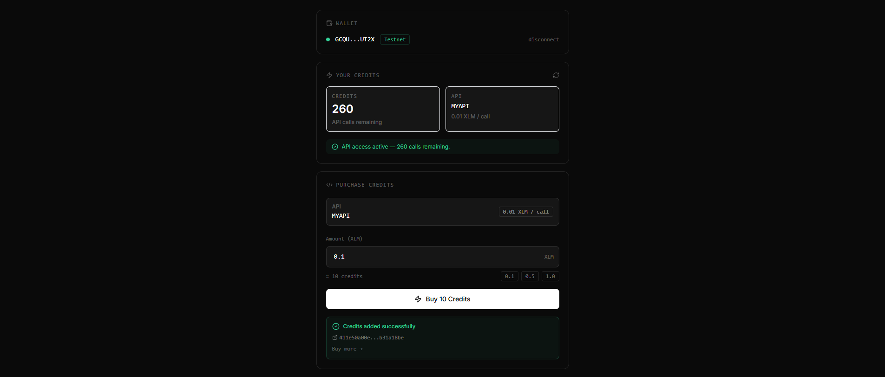
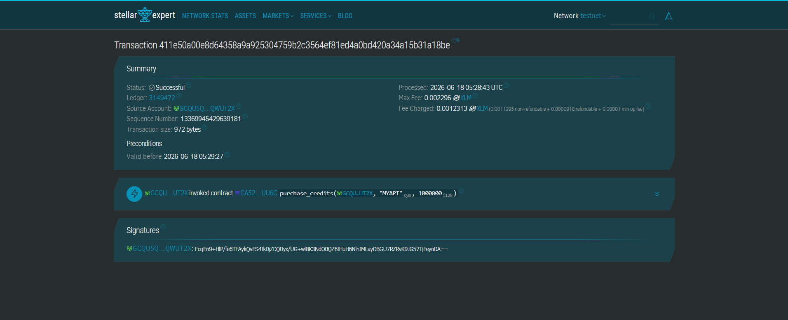

# ⚡ PayScript

> Micropayment paywalls for APIs and digital tools — built on Stellar Soroban


**Live Demo →** [https://stellar-payscript.vercel.app](https://stellar-payscript.vercel.app/)

---

## 🧩 What is PayScript?

PayScript is a small but functional micropayment layer built on Stellar Soroban. It lets developers put a per-call paywall in front of any API or digital tool.

Buyers connect a Freighter wallet, pay in XLM, and receive on-chain credits that unlock API access — no Stripe account, no PayPal fees, no geographic restrictions.

Built as a proof of concept for independent developers in Southeast Asia who have working products but no viable cross-border micropayment option.

---

## 🎯 The Problem

A developer in Cebu selling an AI dataset tool earns $0 from hundreds of monthly API users because:

- **Stripe** requires a US entity
- **PayPal** takes 5–7% and has poor SEA coverage
- **Crypto wallets** intimidate non-technical buyers

There's no sub-$1 payment layer that works across borders without a bank account.

---

## ✅ The Solution

PayScript lets a developer register their API with a price per call. Buyers connect Freighter, pay XLM, and get credits stored on the Stellar Soroban contract. Each API call deducts one credit — verified on-chain, settled in under 5 seconds, for under $0.001 in fees.

**Why Stellar:** Sub-cent fees make per-call pricing actually work. Soroban handles the credit ledger trustlessly. Freighter removes the need for buyers to understand private keys.

---

## 📸 Screenshots

### Wallet Connected


### Credit Balance


### Successful Transaction


### Transaction on Stellar Expert


---

## ✨ Features

### ✅ Implemented
- **Wallet Connection** — Connect Freighter with one click, no seed phrase exposed
- **Credit Balance** — View on-chain credit balance with live refresh
- **Purchase Credits** — Pay XLM → credits stored on Soroban contract
- **Transaction Verification** — Every purchase links to Stellar Expert explorer
- **Error Handling** — Loading states and error messages on every action
- **Mobile Responsive** — Works on all screen sizes
- **CI/CD Pipeline** — GitHub Actions running on every push

### 🗺️ Planned (Level 5+)
- Anchor SEP-24 fiat on-ramp (GCash / Maya)
- x402 agentic payment support for AI agents
- AccessRegistry inter-contract for multi-tier subscriptions
- npm SDK for one-line paywall integration

---

## 🏗️ Architecture

```
Buyer (Freighter Wallet)
        │
        ▼ signs XLM payment tx
Stellar Network
        │
        ▼ payment confirmed → calls contract
PayScript Soroban Contract (lib.rs)
    ├── initialize()       → Sets contract admin
    ├── register_api()     → Developer registers API + price per call
    ├── purchase_credits() → Buyer pays XLM → credits stored on-chain
    ├── verify_access()    → Deducts 1 credit → emits access event
    ├── get_credits()      → Frontend reads buyer balance
    ├── get_price()        → Frontend reads price per call
    └── get_revenue()      → Developer reads total earnings
        │
        ▼ events emitted on purchase and access
Next.js Frontend (Netlify)
    └── Reads contract state → shows balance → handles purchase flow
```

### Inter-Contract Design
`verify_access()` is callable by an external `AccessRegistry` contract. The pattern is implemented — the AccessRegistry deployment is planned for Level 5.

---

## 🔧 Stellar Features Used

| Feature | Usage |
|---|---|
| Soroban smart contracts | Credit ledger, access verification, revenue tracking |
| Soroban events | Payment and access notifications |
| XLM transfers | Buyer payment via Freighter |
| Freighter wallet | Browser-based transaction signing |
| Stellar Expert | On-chain transaction verification |

---

## 🚀 Quick Start

### Prerequisites

- **Rust** — `curl https://sh.rustup.rs -sSf | sh`
- **Stellar CLI** — `cargo install --locked stellar-cli`
- **Node.js 18+**
- **Freighter wallet** — [freighter.app](https://freighter.app)
- **Testnet account** — [laboratory.stellar.org](https://laboratory.stellar.org/#account-creator)

### Run Frontend Locally

```bash
git clone https://github.com/0xhakua-dev/stellar-payscript
cd stellar-payscript/frontend

npm install
cp .env.example .env.local
# Set NEXT_PUBLIC_CONTRACT_ID=CA5275K7CCSSVRP546V6AI45KZJULBHE7IGRLAWMM7WGPQH22NZ2UU6C

npm run dev
# Open http://localhost:3000
```

### Build Contract

```bash
cd contracts/payscript
soroban contract build
# Output: target/wasm32-unknown-unknown/release/payscript.wasm
```

### Run Tests

```bash
cd contracts/payscript
cargo test

# Expected output:
# test tests::test_happy_path_full_mvp_flow ... ok
# test tests::test_access_denied_with_zero_credits ... ok
# test tests::test_state_correct_after_purchase ... ok
# test tests::test_insufficient_payment_rejected ... ok
# test tests::test_credits_accumulate_across_purchases ... ok
# test result: ok. 5 passed; 0 failed
```

---

## 🖥️ Deploy to Testnet

```bash
# Generate and fund deployer identity
stellar keys generate --global deployer --network testnet
stellar keys fund deployer --network testnet

# Deploy
stellar contract deploy \
  --wasm target/wasm32-unknown-unknown/release/payscript.wasm \
  --source deployer \
  --network testnet

# Initialize
stellar contract invoke \
  --id CA5275K7CCSSVRP546V6AI45KZJULBHE7IGRLAWMM7WGPQH22NZ2UU6C \
  --source deployer \
  --network testnet \
  -- initialize \
  --admin GCQU5QFOHE4DUQFVP5GZUWA5EXO2KS5VEYSYAC3MRQFRSVTAQOQWUT2X

# Register API
stellar contract invoke \
  --id CA5275K7CCSSVRP546V6AI45KZJULBHE7IGRLAWMM7WGPQH22NZ2UU6C \
  --source deployer \
  --network testnet \
  -- register_api \
  --owner GCQU5QFOHE4DUQFVP5GZUWA5EXO2KS5VEYSYAC3MRQFRSVTAQOQWUT2X \
  --api_key MYAPI \
  --price_per_call 100000
```

---

## 🧪 Sample CLI Invocations

```bash
# Purchase credits (buyer)
stellar contract invoke \
  --id CA5275K7CCSSVRP546V6AI45KZJULBHE7IGRLAWMM7WGPQH22NZ2UU6C \
  --source buyer-key \
  --network testnet \
  -- purchase_credits \
  --buyer GCQU5QFOHE4DUQFVP5GZUWA5EXO2KS5VEYSYAC3MRQFRSVTAQOQWUT2X \
  --api_key MYAPI \
  --amount_paid 1000000
# 1000000 stroops = 0.1 XLM = 10 credits

# Check credit balance
stellar contract invoke \
  --id CA5275K7CCSSVRP546V6AI45KZJULBHE7IGRLAWMM7WGPQH22NZ2UU6C \
  --network testnet \
  -- get_credits \
  --buyer GCQU5QFOHE4DUQFVP5GZUWA5EXO2KS5VEYSYAC3MRQFRSVTAQOQWUT2X
# Output: 10

# Check API revenue
stellar contract invoke \
  --id CA5275K7CCSSVRP546V6AI45KZJULBHE7IGRLAWMM7WGPQH22NZ2UU6C \
  --network testnet \
  -- get_revenue \
  --api_key MYAPI
```

---

## 📦 Project Structure

```
stellar-payscript/
├── contracts/
│   └── payscript/
│       ├── src/
│       │   ├── lib.rs       # Soroban smart contract
│       │   └── test.rs      # 5 contract tests
│       └── Cargo.toml
├── frontend/
│   ├── components/
│   │   ├── WalletConnect.tsx
│   │   ├── CreditBalance.tsx
│   │   └── PurchaseForm.tsx
│   ├── hooks/
│   │   └── useFreighter.ts
│   ├── lib/
│   │   └── stellar.ts
│   ├── pages/
│   │   ├── _app.tsx
│   │   └── index.tsx
│   ├── styles/
│   │   └── globals.css
│   └── package.json
├── screenshots/
│   ├── wallet-connected.png
│   ├── credit-balance.png
│   ├── transaction-success.png
│   └── stellar-expert.png
├── .github/
│   └── workflows/
│       └── ci.yml
└── README.md
```

---

## 🔗 Deployed Contract

| Item | Value |
|---|---|
| Contract ID | `CA5275K7CCSSVRP546V6AI45KZJULBHE7IGRLAWMM7WGPQH22NZ2UU6C` |
| Network | Stellar Testnet |
| Explorer | [View on Stellar Expert](https://stellar.expert/explorer/testnet/contract/CA5275K7CCSSVRP546V6AI45KZJULBHE7IGRLAWMM7WGPQH22NZ2UU6C) |
| register_api tx | `f2f102200fb6bede14eaffac3cb41f76272c38153d60dbe1fd1e02249bc78536` |

---

## ⚙️ CI/CD

GitHub Actions runs on every push to `main`:
1. `cargo test` — runs all 5 contract tests
2. Netlify auto-deploys frontend on merge

See `.github/workflows/ci.yml`

---

## 🔮 Future Scope

These are honest directions for later levels — not promises.

**Fiat On-Ramp (Level 5)**
Anchor SEP-24 so Philippine buyers can fund their wallet via GCash or Maya without touching crypto directly.

**x402 Agentic Payments (Level 6)**
Native x402 support so AI agents can autonomously purchase API credits — the protocol is new and this is a natural fit.

**AccessRegistry Contract (Level 7)**
A second Soroban contract handling multi-tier subscription logic called via inter-contract communication.

**SDK**
A simple npm package so developers can add a PayScript paywall in one line without touching the contract directly.

---

## 🛠️ Tech Stack

| Technology | Purpose |
|---|---|
| Next.js 14 | React framework |
| TypeScript | Type safety |
| Tailwind CSS | Styling |
| Stellar SDK v12 | Blockchain interactions |
| Freighter API v2 | Wallet signing |
| Soroban (Rust) | Smart contract |
| GitHub Actions | CI/CD |
| Netlify | Frontend hosting |

---

## 🆘 Troubleshooting

**Wallet won't connect?**
- Make sure Freighter is installed and unlocked
- Switch Freighter to Testnet not Mainnet
- Refresh the page and try again

**Balance shows 0 after purchase?**
- Click the refresh icon on the credits panel
- Wait 5 seconds for the transaction to confirm

**Transaction fails?**
- Fund your testnet account at [laboratory.stellar.org](https://laboratory.stellar.org/#account-creator)
- Keep at least 1 XLM as account reserve

---

## 📝 License

MIT © 2026 PayScript — [0xhakua-dev](https://github.com/0xhakua-dev)

Permission is hereby granted, free of charge, to any person obtaining a copy of this software and associated documentation files (the "Software"), to deal in the Software without restriction, including without limitation the rights to use, copy, modify, merge, publish, distribute, sublicense, and/or sell copies of the Software, and to permit persons to whom the Software is furnished to do so, subject to the following conditions: The above copyright notice and this permission notice shall be included in all copies or substantial portions of the Software. THE SOFTWARE IS PROVIDED "AS IS", WITHOUT WARRANTY OF ANY KIND, EXPRESS OR IMPLIED.